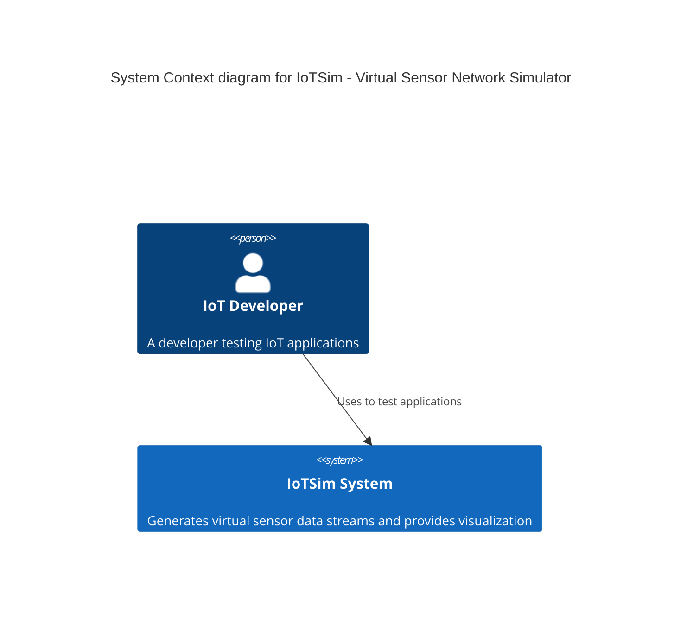
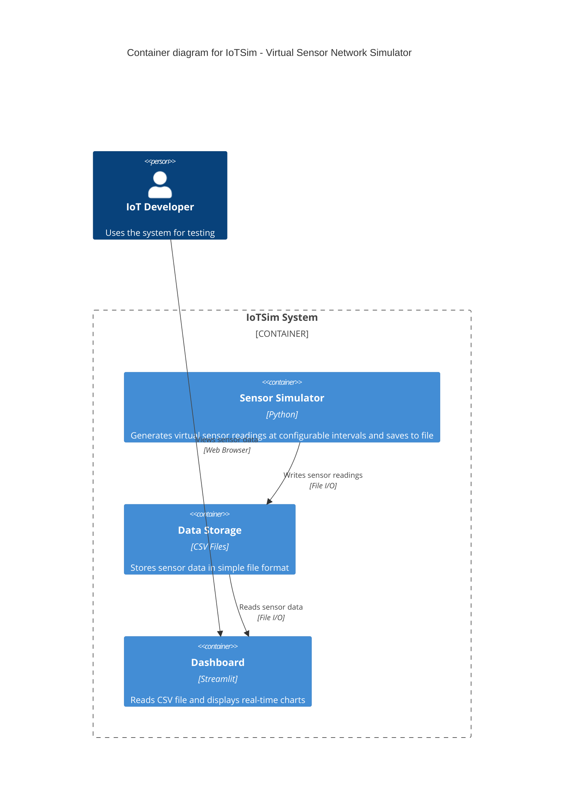
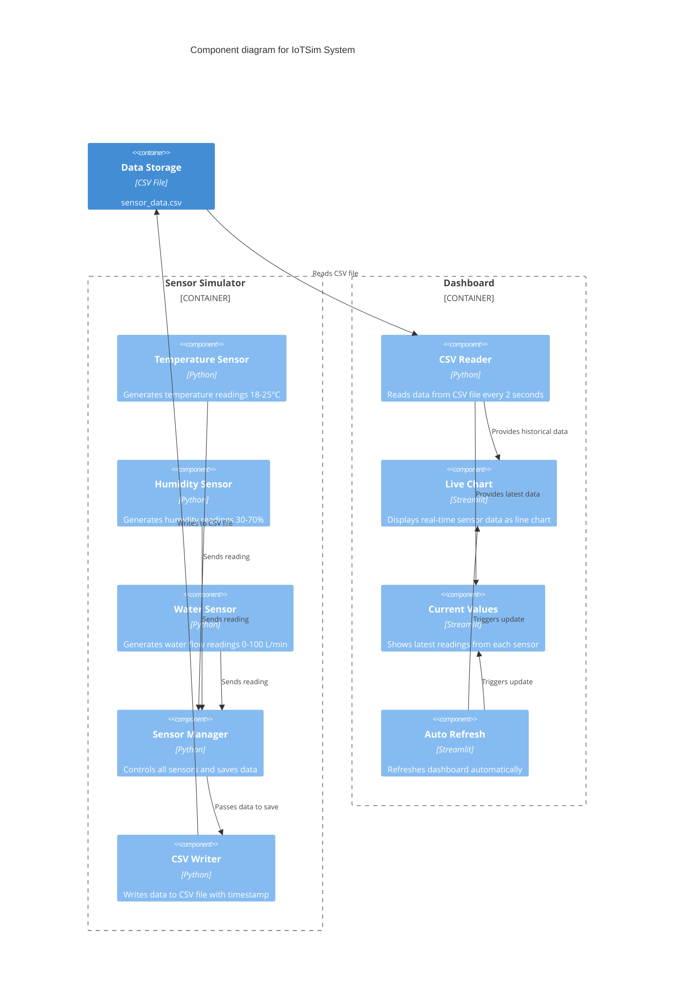
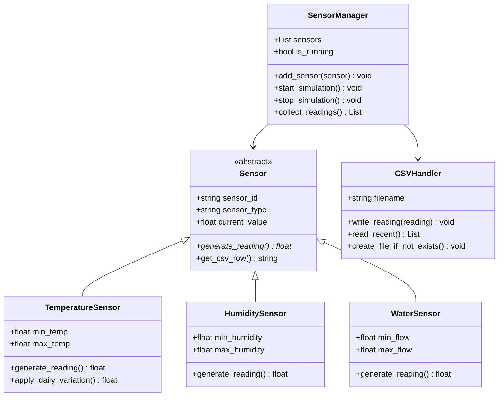
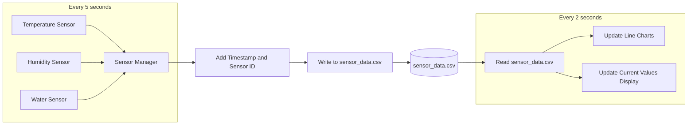
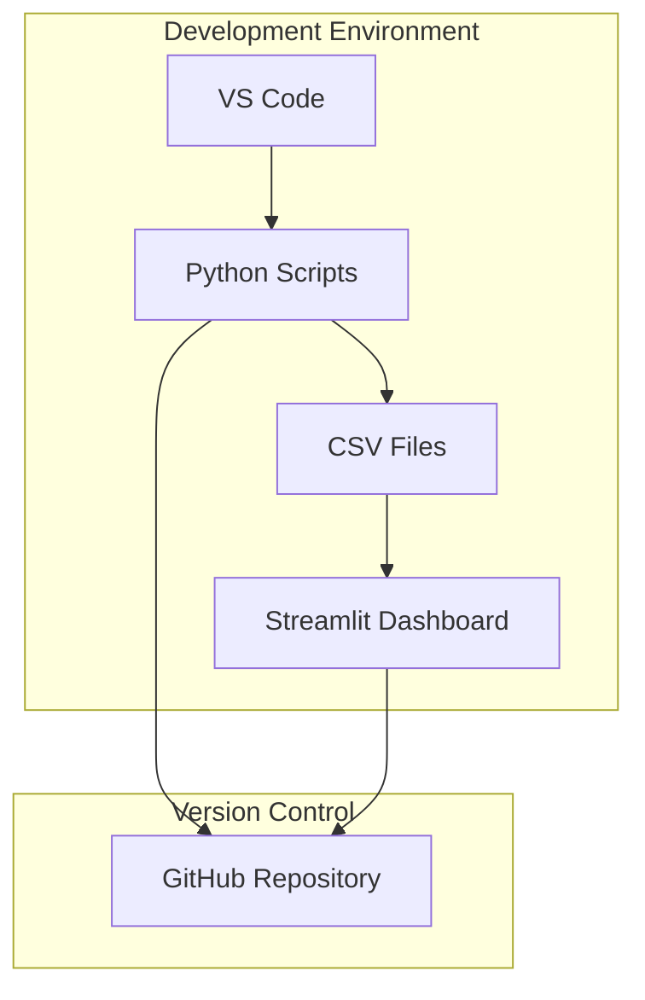

# Architecture Documentation: IoTSim - Virtual Sensor Network Simulator

## Project Information
- **Project Title:** IoTSim: Virtual Sensor Network Simulator
- **Domain:** IoT Systems / Smart Infrastructure
- **Problem Statement:** Developers cannot easily test IoT systems without physical sensors
- **Individual Scope:** Feasible as a semester project due to modular architecture

## C4 Model Diagrams

The C4 model documents the architecture of IoTSim at four levels of abstraction:
1. **Context Diagram** (System Context)
2. **Container Diagram** (High-level technology breakdown)
3. **Component Diagram** (Inside each container)
4. **Code Diagram** (Class-level - represented as UML class diagram)

---

## Level 1: System Context Diagram

This diagram shows IoTSim in the context of its users.

### Context Diagram Description
- **IoT Developer**: Primary user who uses the simulated data to test IoT applications
- **IoTSim System**: The core system being built
---

## Level 2: Container Diagram

This diagram zooms into the IoTSim system, showing the high-level technology containers.

### Container Diagram Description

| Container | Technology | Purpose |
|-----------|------------|---------|
| **Sensor Simulator** | Python | Generates simulated sensor readings (temperature, humidity, water) and saves to file |
| **Data Storage** | CSV Files | Stores sensor data in simple comma-separated value format that any program can read |
| **Dashboard** | Streamlit | Reads CSV file and displays live-updating charts and sensor readings |

---

## Level 3: Component Diagram

This diagram shows the internal components of each container.

### Component Description

| Component | Responsibility |
|-----------|----------------|
| **Temperature Sensor** | Generates realistic temperature readings between 18-25°C with small variations |
| **Humidity Sensor** | Generates humidity readings between 30-70% with realistic patterns |
| **Water Sensor** | Generates water flow readings between 0-100 L/min |
| **Sensor Manager** | Runs all sensors, collects readings, adds timestamps, sends to file writer |
| **CSV Writer** | Appends each reading as a new row in sensor_data.csv |
| **CSV Reader** | Reads the CSV file every 2 seconds to get latest data |
| **Live Chart** | Displays line chart of sensor readings over time |
| **Current Values** | Shows big numbers with current temperature, humidity, water flow |
| **Auto Refresh** | Makes dashboard update automatically every 2 seconds |

---

## Level 4: Code Diagram (Sensor Simulator Class Diagram)

This diagram shows the key classes in the Sensor Simulator container.

### Key Classes Description

| Class | Responsibility |
|-------|----------------|
| **Sensor (Abstract)** | Base class that all sensors inherit from |
| **TemperatureSensor** | Simulates temperature with daily cycle (warmer day, cooler night) |
| **HumiditySensor** | Simulates humidity with realistic variations |
| **WaterSensor** | Simulates water flow with random changes |
| **SensorManager** | Runs the simulation loop and manages all sensors |
| **CSVHandler** | Handles all file reading and writing operations |

---

## End-to-End Data Flow

This diagram illustrates how data flows through the complete system:

### Data Flow Description

1. **Every 5 seconds**, each sensor generates a new reading
2. **Sensor Manager** collects all readings and adds a timestamp
3. **CSV Writer** appends one line to `sensor_data.csv` with format: `timestamp,sensor_type,sensor_id,value`
4. **Every 2 seconds**, the dashboard reads the CSV file
5. **Live Chart** updates with new historical data
6. **Current Values** display the most recent reading from each sensor

---

## 5. Technology Stack

| Component | Technology | Selection Rationale |
|-----------|------------|---------------------|
| Sensor Simulator | Python | Python's simplicity and rich ecosystem for simulation |
| Data Storage | CSV Files | Built into Python, no setup required, easy to read/write |
| Dashboard | Streamlit | Minimal code, automatic refresh, beautiful charts |
| Version Control | Git/GitHub | Industry standard, project hosting |
| Development | VS Code | Free, extensible, already in use |

## Deployment Architecture

---

## Conclusion

The IoTSim architecture follows a modular, containerized approach that enables:
- **Independent development** of each component
- **Scalability** to add more sensor types or processing capabilities
- **Testability** through clear interfaces and separation of concerns
- **Maintainability** with well-documented code and standardized patterns

This architecture fully captures the end-to-end components required for the assignment: Sensor Simulator → Data Stream → Processing Service → Dashboard.