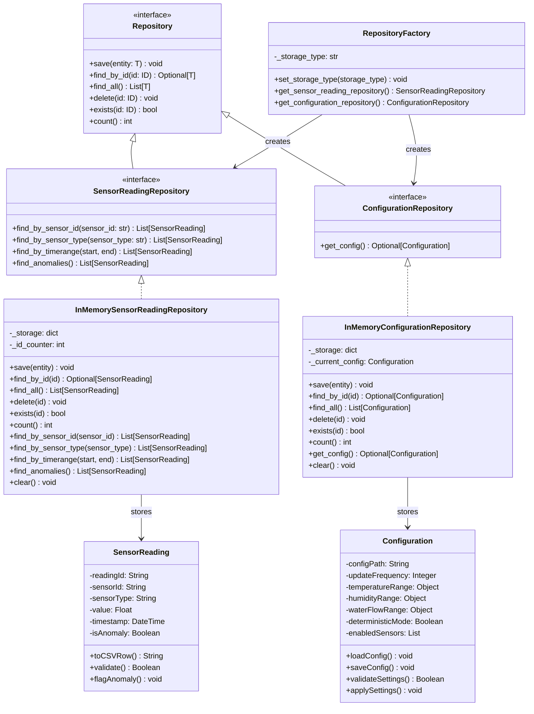

# Updated Class Diagram with Repository Layer

## Mermaid.js Class Diagram

## Repository Pattern

The repository layer abstracts storage details behind interfaces:

| Component | Purpose |
|---|---|
| `Repository<T, ID>` | Generic interface with CRUD operations |
| `SensorReadingRepository` | Entity-specific interface for sensor readings |
| `ConfigurationRepository` | Entity-specific interface for configuration |

### Implementations

| Implementation | Storage | Purpose |
|---|---|---|
| `InMemorySensorReadingRepository` | HashMap | Fast testing, no persistence |
| `InMemoryConfigurationRepository` | HashMap | Testing configuration storage |

---

## Factory Pattern

`RepositoryFactory` switches between storage backends:

- Set `storage_type = "MEMORY"` for in-memory storage
- Future: `"FILE"` for JSON file storage
- Future: `"DATABASE"` for SQL database storage

---

## Future-Proofing

New storage backends can be added by:

1. Creating a new class implementing the interface
2. Adding a new case in `RepositoryFactory`
3. No changes to existing code *(Open/Closed Principle)*
