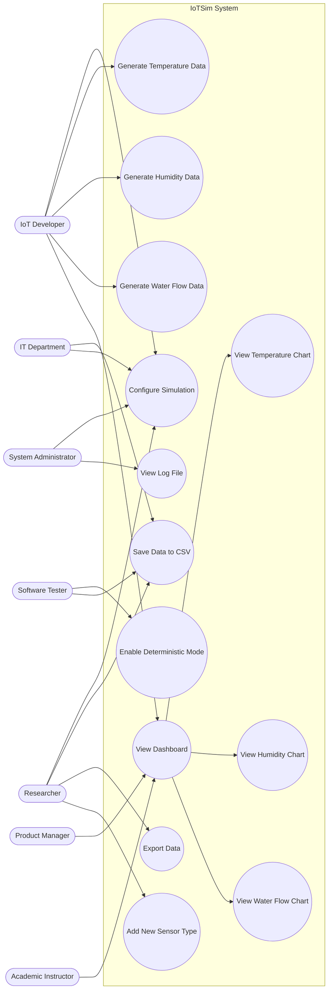

## 1. Use Case Diagram

### 1.1 Diagram

## 1.2 Explanation

### Actors and Their Roles

The system includes seven primary actors, each representing a stakeholder identified in Assignment 4. These actors interact with the system based on their specific responsibilities and goals.

| Actor | Role | Stakeholder ID |
|-------|------|----------------|
| IoT Developer | Configures simulation, generates sensor data, views dashboard to test IoT applications | S1 |
| Software Tester | Enables deterministic mode for repeatable testing, verifies CSV output | S2 |
| System Administrator | Configures simulation parameters, checks log files for errors | S3 |
| Product Manager | Views dashboard to demonstrate live updates to clients | S4 |
| IT Department | Ensures CSV storage works locally without external services | S5 |
| Academic Instructor | Views dashboard to teach students about IoT data visualization | S6 |
| Researcher | Configures parameters, exports data, adds new sensor types for experiments | S7 |

---

### Relationships and Dependencies

| Relationship | Explanation |
|--------------|------------|
| View Dashboard includes View Temperature Chart, View Humidity Chart, View Water Flow Chart | The dashboard is the main interface; all charts are part of it |
| Generate Temperature, Humidity, Water Flow Data are independent | Each sensor type runs separately but all feed into Save Data to CSV |
| Configure Simulation enables Generate Data use cases | Simulation parameters (frequency, ranges) control how data is generated |
| Enable Deterministic Mode affects Generate Data use cases | When enabled, random seed is fixed so data repeats |

---

### Alignment with Stakeholder Concerns

| Stakeholder Concern | Addressed By |
|--------------------|-------------|
| S1 (Developer): Realistic data | Generate Temperature/Humidity/Water Flow with realistic patterns |
| S2 (Tester): Repeatable data | Enable Deterministic Mode |
| S3 (Admin): Simple monitoring | View Log File |
| S4 (PM): Demo-ready dashboard | View Dashboard and chart use cases |
| S5 (IT): Local-only operation | Save Data to CSV (no external services) |
| S6 (Instructor): Clear teaching | View Dashboard with visible charts |
| S7 (Researcher): Configurable experiments | Configure Simulation, Add New Sensor Type, Export Data |

---