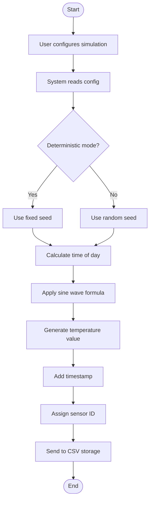
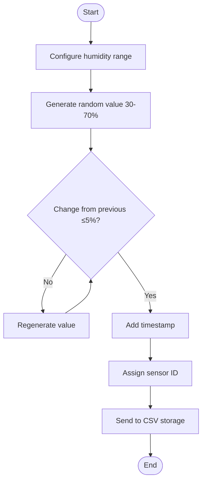
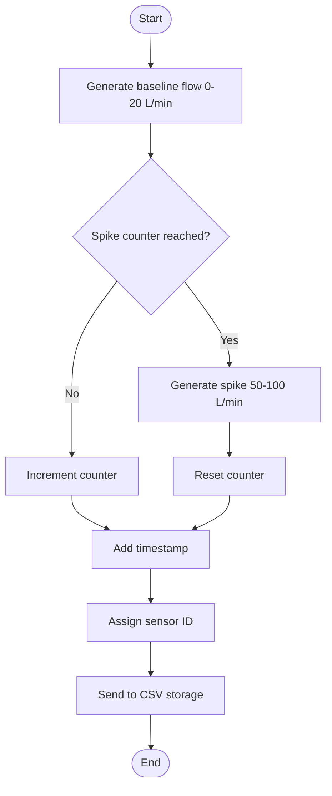
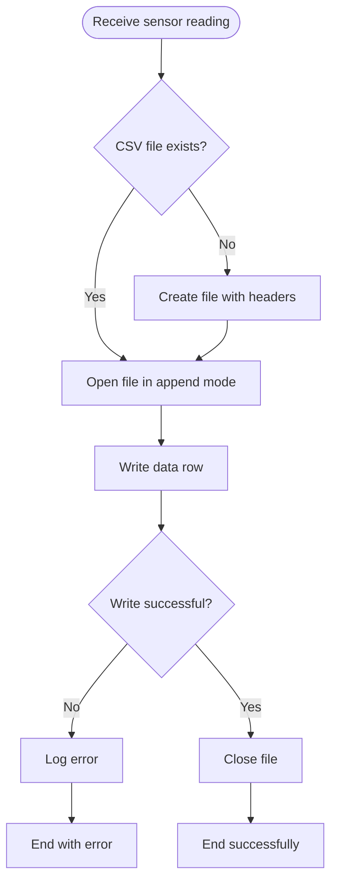
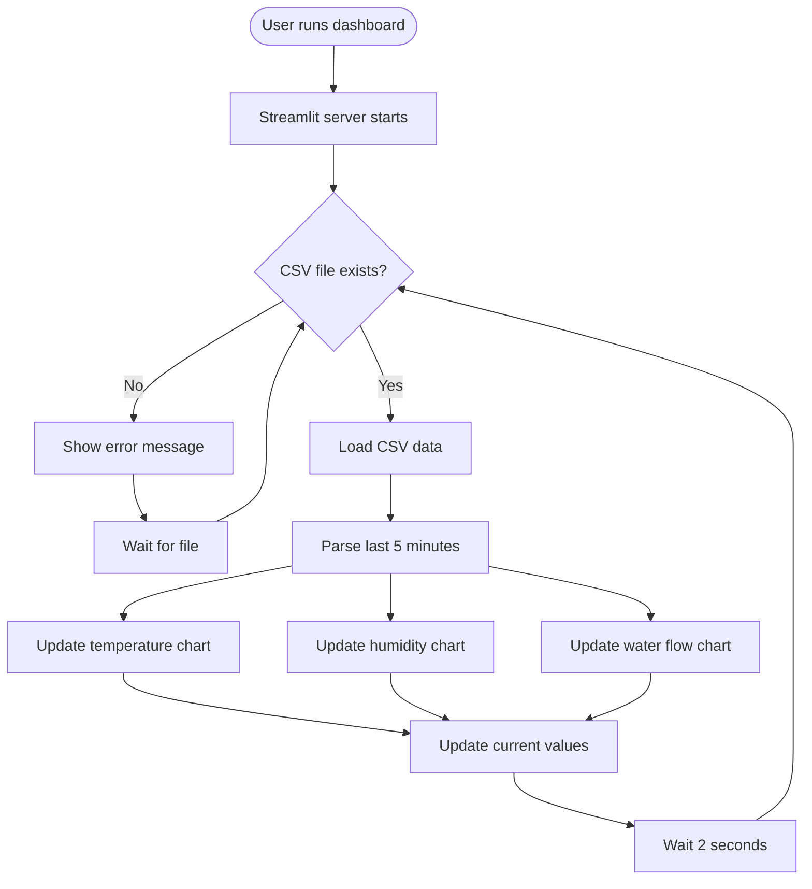
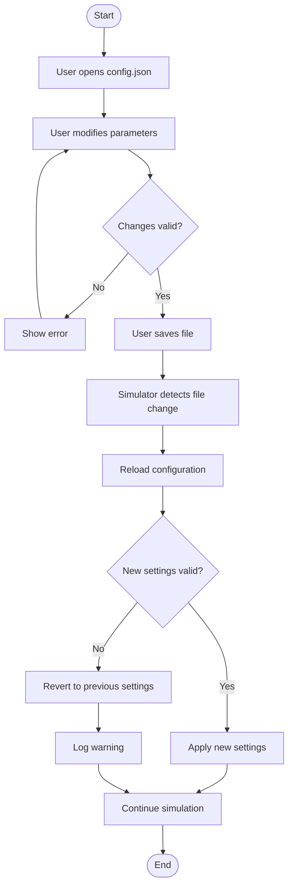
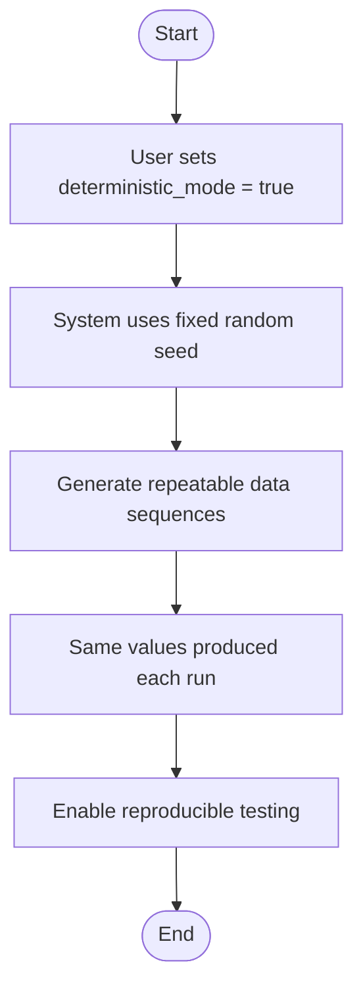
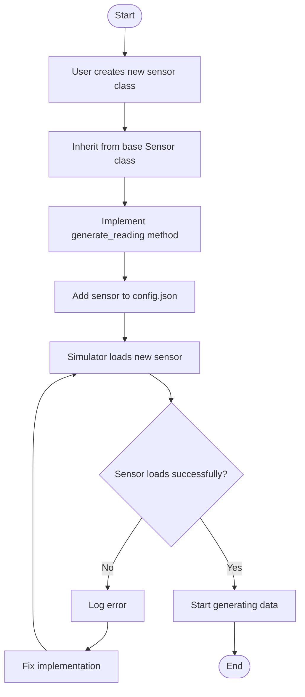

# Activity Diagrams: IoTSim

## Traceability to Requirements
All activity diagrams map to functional requirements from Assignment 4 and user stories from Assignment 6.

---

## Diagram 1: Generate Temperature Data Workflow

### Detailed Activity Diagram with Decisions

**Swimlanes:**
- **User**: Configures simulation, edits config.json, saves file
- **System**: Reads config, generates data, adds timestamp, sends to storage

### Explanation

| Element | Description | Related FR | Related US |
|---------|-------------|------------|------------|
| Start Node | User initiates simulation | - | - |
| Configure simulation | User sets parameters | FR-04 | US-004 |
| Read config | System loads settings | FR-04 | US-004 |
| Deterministic mode check | Decision branch for repeatable data | - | US-004 |
| Calculate time of day | Determine peak/minimum times | FR-01 | US-001 |
| Apply sine wave | Temperature follows daily cycle | FR-01 | US-001 |
| Generate value | Produce temperature reading | FR-01 | US-001 |
| Add timestamp | Include milliseconds | FR-10 | US-006 |
| Assign sensor ID | Unique identifier | FR-06 | US-005 |
| Send to CSV storage | Pass to storage module | FR-07 | US-006 |
| End Node | Workflow complete | - | - |

---

## Diagram 2: Generate Humidity Data Workflow

### Explanation

| Element | Description | Related FR | Related US |
|---------|-------------|------------|------------|
| Configure humidity range | User sets parameters | FR-04 | US-004 |
| Generate random value | Within 30-70% | FR-02 | US-002 |
| Change check | Ensures realistic variation | FR-02 | US-002 |
| Regenerate | If change >5%, try again | FR-02 | US-002 |

---

## Diagram 3: Generate Water Flow Data Workflow

### Explanation

| Element | Description | Related FR | Related US |
|---------|-------------|------------|------------|
| Generate baseline | Normal flow (0-20 L/min) | FR-03 | US-003 |
| Spike counter check | Every 10-20 readings | FR-03 | US-003 |
| Generate spike | Usage event (50-100 L/min) | FR-03 | US-003 |
| Reset counter | After spike occurs | FR-03 | US-003 |

---

## Diagram 4: Save Data to CSV Workflow

### Explanation

| Element | Description | Related FR | Related US |
|---------|-------------|------------|------------|
| Receive reading | Data from sensor | FR-07 | US-006 |
| Check existence | Create if missing | FR-08 | US-006 |
| Create with headers | timestamp,sensor_type,sensor_id,value | FR-08 | US-006 |
| Append mode | Don't overwrite existing data | FR-09 | US-006 |
| Write row | Add new reading | FR-09 | US-006 |
| Log error | If write fails | - | - |

**Swimlanes:** System (all actions - sensor reading, file operations, logging)

---

## Diagram 5: Dashboard Display Workflow

### Explanation

| Element | Description | Related FR | Related US |
|---------|-------------|------------|------------|
| Run dashboard | User starts application | - | - |
| Server starts | Streamlit initializes | NFR-13 | - |
| Check CSV exists | Verify data source | FR-11 | US-007 |
| Load CSV | Read file contents | FR-11 | US-007 |
| Parse data | Extract last 5 minutes | FR-12, FR-13, FR-14 | US-007 |
| Update charts | Refresh visualizations | FR-12, FR-13, FR-14 | US-007 |
| Update current values | Display latest readings | FR-15 | US-008 |
| Wait 2 seconds | Auto-refresh interval | FR-16 | US-009 |

**Parallel Actions:**
- Temperature chart, humidity chart, water flow chart update simultaneously
- Current values update alongside charts

---

## Diagram 6: Configure Simulation Workflow

### Explanation

| Element | Description | Related FR | Related US |
|---------|-------------|------------|------------|
| Open config.json | User edits file | FR-04 | US-004 |
| Modify parameters | Change values | FR-04 | US-004 |
| Validate changes | Check range, format | - | - |
| Detect file change | Simulator monitors file | FR-05 | US-004 |
| Reload config | Read new values | FR-05 | US-004 |
| Apply settings | Use new values | FR-05 | US-004 |

**Swimlanes:**
- **User**: Opens, edits, saves config.json
- **System**: Validates, reloads, applies, logs errors

---

## Diagram 7: Enable Deterministic Mode Workflow

### Explanation

| Element | Description | Related FR | Related US |
|---------|-------------|------------|------------|
| Set deterministic_mode | User enables feature | - | US-004 |
| Fixed random seed | Same seed each run | - | US-004 |
| Repeatable data | Identical values each run | - | US-004 |

---

## Diagram 8: Add New Sensor Type Workflow

### Explanation

| Element | Description | Related FR | Related US |
|---------|-------------|------------|------------|
| Create new class | Extend system | NFR-08 | US-011 |
| Inherit from Sensor | Use base class | NFR-08 | US-011 |
| Implement generate_reading | Custom logic | NFR-08 | US-011 |
| Add to config | Enable sensor | FR-04 | US-004 |
| Load new sensor | System detects | FR-05 | US-004 |

**Swimlanes:**
- **User**: Creates class, implements method, updates config
- **System**: Loads sensor, generates data, logs errors

---

## Summary: Activity Diagrams

| Diagram | Workflow | Number of Steps | Swimlanes | Decisions |
|---------|----------|----------------|-----------|-----------|
| 1 | Generate Temperature Data | 12 | 2 | 1 |
| 2 | Generate Humidity Data | 12 | 2 | 2 |
| 3 | Generate Water Flow Data | 11 | 2 | 1 |
| 4 | Save Data to CSV | 9 | 1 | 2 |
| 5 | Dashboard Display | 10 | 1 | 1 |
| 6 | Configure Simulation | 12 | 2 | 2 |
| 7 | Enable Deterministic Mode | 6 | 1 | 0 |
| 8 | Add New Sensor Type | 10 | 2 | 1 |
