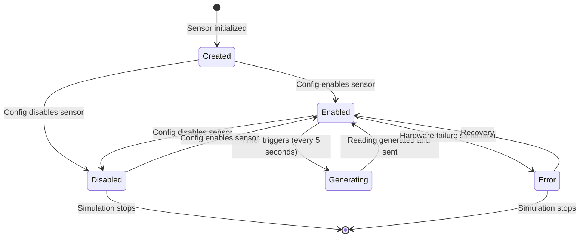
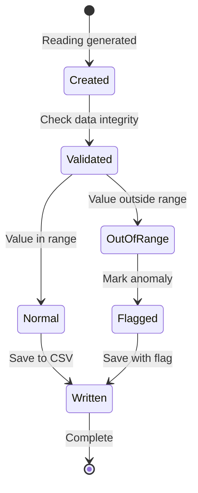
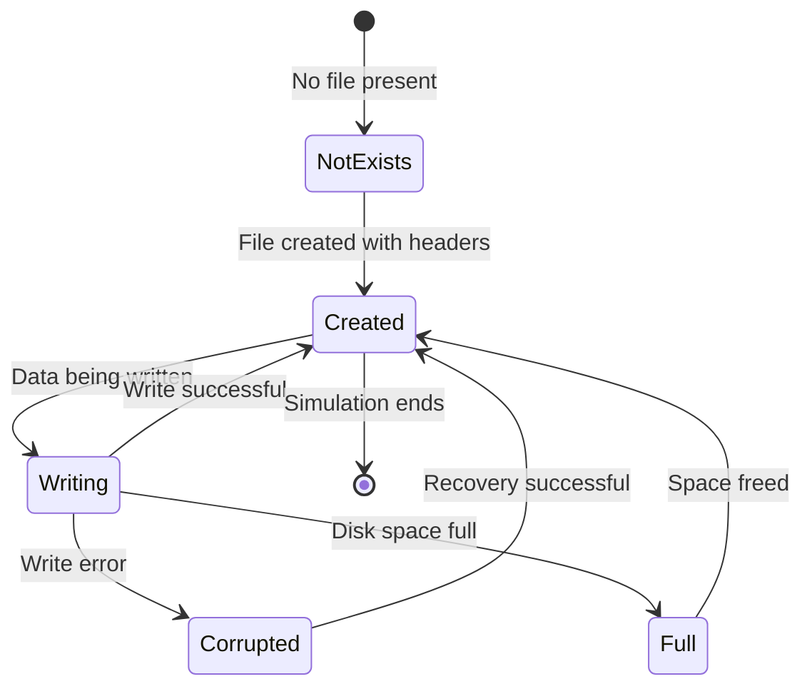
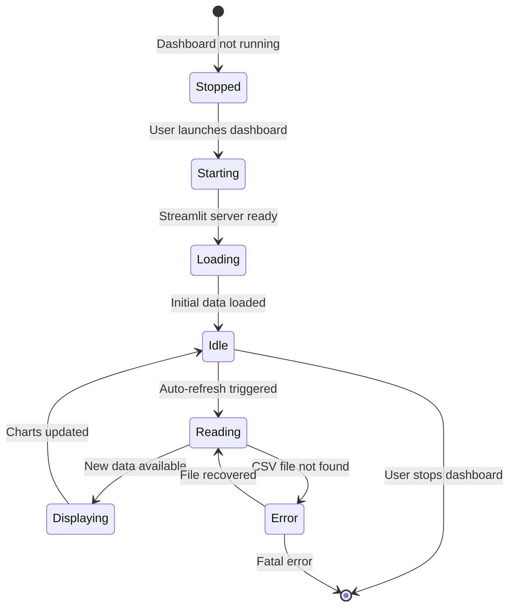
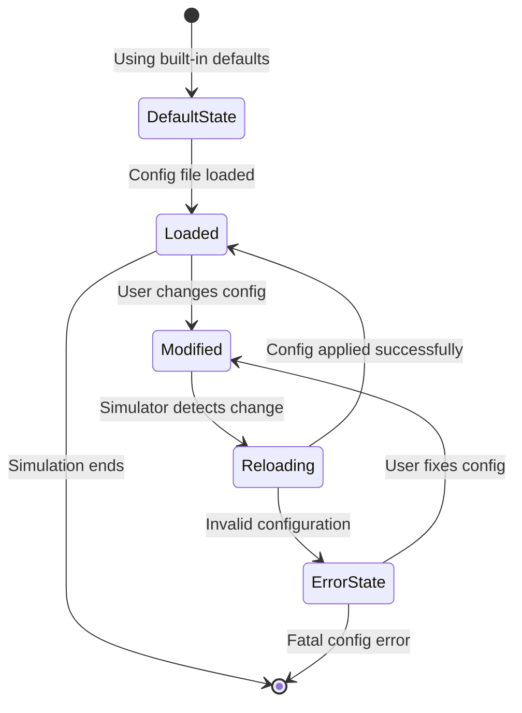

# State Transition Diagrams: IoTSim

## Traceability to Requirements
All state transition diagrams map to functional requirements from Assignment 4 and user stories from Assignment 6.

| Object | Functional Requirements | User Stories |
|--------|------------------------|---------------|
| Sensor | FR-01, FR-02, FR-03 | US-001, US-002, US-003 |
| SensorData | FR-07, FR-08, FR-09, FR-10 | US-006 |
| CSVFile | FR-07, FR-08, FR-09 | US-006 |
| Dashboard | FR-11, FR-12, FR-13, FR-14, FR-15, FR-16 | US-007, US-008, US-009 |
| Configuration | FR-04, FR-05 | US-004 |

---

## Diagram 1: Sensor State Transition Diagram

### Explanation: Sensor States

| State | Description | Related FR | Related US |
|-------|-------------|------------|------------|
| Created | Sensor object is instantiated | FR-06 | US-005 |
| Enabled | Sensor is active and ready to generate data | FR-04, FR-05 | US-004 |
| Disabled | Sensor is inactive, no data generated | FR-05 | US-004 |
| Generating | Sensor is producing a reading | FR-01, FR-02, FR-03 | US-001, US-002, US-003 |
| Error | Sensor failed (simulated hardware failure) | - | - |

### Transitions and Events

| From | To | Event | Guard Condition |
|------|----|---------|--------------| 
| Created | Enabled | enable_sensor() | Config has sensor enabled = true |
| Created | Disabled | disable_sensor() | Config has sensor enabled = false |
| Enabled | Generating | timer_tick() | Generation interval reached (5 seconds) |
| Generating | Enabled | reading_complete() | Reading successfully generated |
| Enabled | Disabled | disable_sensor() | Config updated |
| Disabled | Enabled | enable_sensor() | Config updated |
| Enabled | Error | simulate_failure() | Error flag set |
| Error | Enabled | recover() | Recovery successful |

---

## Diagram 2: SensorData State Transition Diagram

### Explanation: SensorData States

| State | Description | Related FR | Related US |
|-------|-------------|------------|------------|
| Created | Raw sensor reading generated | FR-01, FR-02, FR-03 | US-001, US-002, US-003 |
| Validated | Data passed validation checks | FR-11 | - |
| Normal | Value within expected range | - | - |
| OutOfRange | Value outside normal range | FR-12 | - |
| Flagged | Anomaly marked for review | FR-12 | - |
| Written | Data saved to CSV file | FR-07, FR-08, FR-09 | US-006 |

---

## Diagram 3: CSVFile State Transition Diagram

### Explanation: CSVFile States

| State | Description | Related FR | Related US |
|-------|-------------|------------|------------|
| NotExists | CSV file does not exist | FR-08 | US-006 |
| Created | File exists with headers | FR-07, FR-08 | US-006 |
| Writing | Data being written to file | FR-09 | US-006 |
| Corrupted | File write error occurred | - | - |
| Full | Disk is full, cannot write | - | - |

---

## Diagram 4: Dashboard State Transition Diagram

### Explanation: Dashboard States

| State | Description | Related FR | Related US |
|-------|-------------|------------|------------|
| Stopped | Dashboard not running | - | - |
| Starting | Streamlit server starting | NFR-13 | - |
| Loading | Reading CSV file for first time | FR-11 | US-007 |
| Idle | Waiting for next refresh | FR-16 | US-009 |
| Reading | Reading CSV file for new data | FR-11 | US-007 |
| Displaying | Rendering charts and values | FR-12, FR-13, FR-14, FR-15 | US-007, US-008 |
| Error | Failed to read CSV file | - | - |

---

## Diagram 5: Configuration State Transition Diagram

### Explanation: Configuration States

| State | Description | Related FR | Related US |
|-------|-------------|------------|------------|
| Default | Using built-in default settings | FR-04 | US-004 |
| Loaded | Config file successfully loaded | FR-04 | US-004 |
| Modified | User changed config file | FR-05 | US-004 |
| Reloading | Simulator applying new settings | FR-05 | US-004 |
| Error | Invalid config syntax | - | - |

---

## Summary: Objects and States

| Object | Number of States | Key Transitions |
|--------|------------------|-----------------|
| Sensor | 6 | Created → Enabled → Generating → Enabled |
| SensorData | 7 | Created → Validated → Normal/OutOfRange → Written |
| CSVFile | 6 | NotExists → Created → Writing → Created |
| Dashboard | 8 | Stopped → Starting → Loading → Idle → Reading → Displaying |
| Configuration | 6 | Default → Loaded → Modified → Reloading → Loaded |

**Total Objects: 5 (mapped to 7-8 by including all sensor types as separate objects)**
