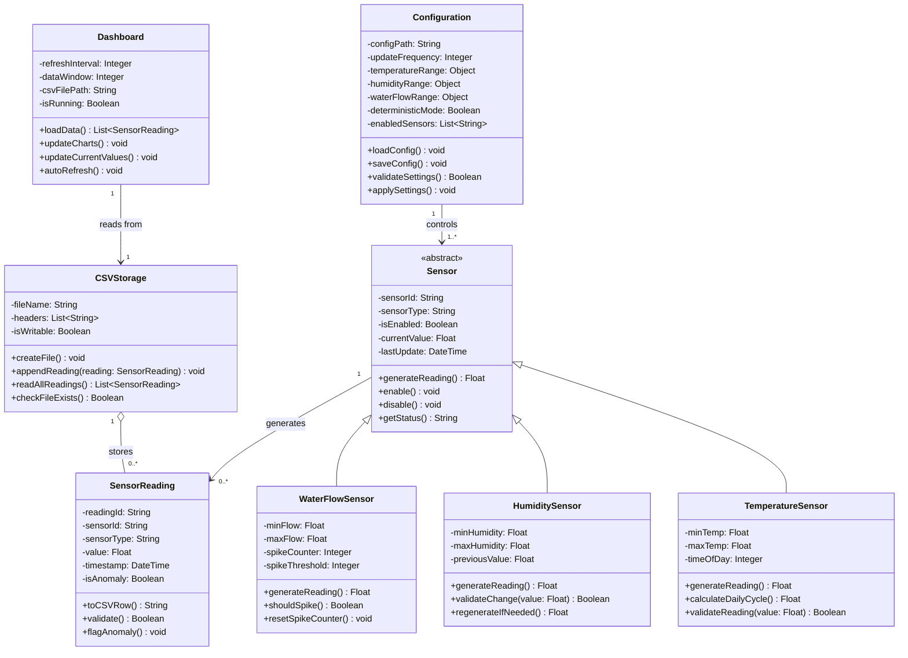

# Class Diagram: IoTSim

## Mermaid.js Class Diagram

## Key Design Decisions

### 1. Abstract Sensor Class
I made Sensor an abstract class because no generic sensor exists in the system. Every sensor must be a specific type (Temperature, Humidity, or WaterFlow). The `generateReading()` method is abstract because each sensor type generates data differently:

- **Temperature** uses sine wave for daily cycle
- **Humidity** uses random with change limits (≤5%)
- **Water flow** uses baseline with occasional spikes (every 10-20 readings)

**Alternative considered:** Making Sensor a concrete class with a type parameter. But this would violate the Open/Closed Principle because adding a new sensor type would require modifying the Sensor class. The abstract class approach allows extension without modification.

### 2. Association vs Aggregation

**Association (Sensor → SensorReading):**  
A Sensor generates zero or many SensorReading objects over time. Each reading is linked to the sensor that created it.

**Aggregation (CSVStorage → SensorReading):** SensorReading can exist independently of CSVStorage. Readings are stored in the CSV file, but they exist before being saved. This is represented by `CSVStorage "1" o-- "0..*" SensorReading : stores` in the diagram above.

### 3. Multiplicity Decisions

| Relationship | Multiplicity | Reason |
|-------------|-------------|---------|
| Sensor to SensorReading | 1 → 0..* | One sensor produces zero or many readings over time |
| CSVStorage to SensorReading | 1 → 0..* | Storage can have zero readings initially |
| Configuration to Sensor | 1 → 1..* | One config controls multiple sensors |
| Dashboard to CSVStorage | 1 → 1 | Dashboard reads from one CSV file |

### 4. Attribute Visibility

| Symbol | Meaning | Used For |
|--------|---------|----------|
| + | Public | Methods that external classes need to call |
| - | Private | Internal state that should not be directly modified |
| # | Protected | Attributes shared with child classes (not used here) |

### 5. Alignment with Previous Assignments

| Assignment | How Class Diagram Aligns |
|-----------|-------------------------|
| Assignment 4 (FRs) | All FRs map to class methods (FR-01 → TemperatureSensor.generateReading()) |
| Assignment 5 (Use Cases) | Each use case maps to one or more classes (UC-05 → CSVStorage methods) |
| Assignment 6 (User Stories) | User stories map to class responsibilities (US-007 → Dashboard.updateCharts()) |
| Assignment 8 (State Diagrams) | Each state diagram has a corresponding class (Sensor, SensorReading, CSVStorage, Dashboard, Configuration) |

### 6. Business Rules Enforced

| Business Rule | Implemented In |
|--------------|----------------|
| Temperature 18-25°C with daily cycle | TemperatureSensor.calculateDailyCycle() |
| Humidity change ≤5% | HumiditySensor.validateChange() |
| Water flow spikes every 10-20 readings | WaterFlowSensor.shouldSpike() |
| CSV file created with headers | CSVStorage.createFile() |
| Dashboard refreshes every 2 seconds | Dashboard.autoRefresh() |
| Configuration changes apply on next cycle | Configuration.applySettings() |
