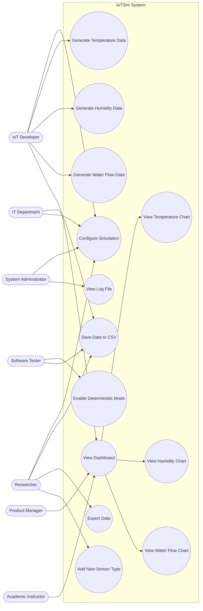

# Use Case and Test Document: IoTSim - Virtual Sensor Network Simulator

## Document Information
- **Project:** IoTSim: Virtual Sensor Network Simulator
- **Author:** Zandre Coetzee
- **Date:** March 27, 2026
- **Assignment:** 5 - Use Case Modeling and Test Case Development

---

## 1. Use Case Diagram

### 1.1 Diagram

## 1.2 Written Explanation

### Actors and Their Roles

The system includes seven primary actors, each representing a stakeholder identified in Assignment 4. These actors interact with the system based on their specific responsibilities and goals.

| Actor | Role | Stakeholder ID |
|-------|------|----------------|
| IoT Developer | Configures simulation, generates sensor data, views dashboard to test IoT applications | S1 |
| Software Tester | Enables deterministic mode for repeatable testing, verifies CSV output | S2 |
| System Administrator | Configures simulation parameters, checks log files for errors | S3 |
| Product Manager | Views dashboard to demonstrate live updates to clients | S4 |
| IT Department | Ensures CSV storage works locally without external services | S5 |
| Academic Instructor | Views dashboard to teach students about IoT data visualization | S6 |
| Researcher | Configures parameters, exports data, adds new sensor types for experiments | S7 |

---

### Relationships and Dependencies

| Relationship | Explanation |
|--------------|------------|
| View Dashboard includes View Temperature Chart, View Humidity Chart, View Water Flow Chart | The dashboard is the main interface; all charts are part of it |
| Generate Temperature, Humidity, Water Flow Data are independent | Each sensor type runs separately but all feed into Save Data to CSV |
| Configure Simulation enables Generate Data use cases | Simulation parameters (frequency, ranges) control how data is generated |
| Enable Deterministic Mode affects Generate Data use cases | When enabled, random seed is fixed so data repeats |

---

### Alignment with Stakeholder Concerns

| Stakeholder Concern | Addressed By |
|--------------------|-------------|
| S1 (Developer): Realistic data | Generate Temperature/Humidity/Water Flow with realistic patterns |
| S2 (Tester): Repeatable data | Enable Deterministic Mode |
| S3 (Admin): Simple monitoring | View Log File |
| S4 (PM): Demo-ready dashboard | View Dashboard and chart use cases |
| S5 (IT): Local-only operation | Save Data to CSV (no external services) |
| S6 (Instructor): Clear teaching | View Dashboard with visible charts |
| S7 (Researcher): Configurable experiments | Configure Simulation, Add New Sensor Type, Export Data |

---

## 2. Use Case Specifications

### Use Case 1: Configure Simulation

| Field | Content |
|-------|---------|
| Use Case ID | UC-01 |
| Use Case Name | Configure Simulation |
| Actors | IoT Developer, System Administrator, Researcher |
| Description | User modifies simulation parameters such as update frequency, sensor value ranges, and which sensors are enabled |
| Preconditions | `config.json` file exists |
| Postconditions | New settings applied. Next simulation cycle uses updated values |

**Basic Flow:**
1. User opens `config.json` in a text editor  
2. User modifies parameters (e.g., temperature range, update interval)  
3. User saves the file  
4. Simulator detects file change on next cycle  
5. Simulator applies new settings  

**Alternative Flow (File Not Found):**
1. Simulator starts and `config.json` does not exist  
2. System creates default config file with standard values  
3. Use case continues with default settings  

---

### Use Case 2: Generate Temperature Data

| Field | Content |
|-------|---------|
| Use Case ID | UC-02 |
| Use Case Name | Generate Temperature Data |
| Actors | IoT Developer, Researcher |
| Description | System generates temperature readings between 18-25°C following a daily cycle |
| Preconditions | Simulation is running, temperature sensor enabled |
| Postconditions | Temperature reading generated and added to data queue for CSV storage |

**Basic Flow:**
1. Simulator timer reaches generation interval  
2. System calculates current time of day  
3. System calculates temperature using sine wave (peak at 2pm, minimum at 4am)  
4. System assigns unique sensor ID  
5. System adds timestamp in ISO format  
6. Reading passed to Save Data to CSV  

**Alternative Flow (Sensor Disabled):**
1. User disables temperature sensor in config  
2. Simulator skips generation for this sensor type  

---

### Use Case 3: Generate Humidity Data

| Field | Content |
|-------|---------|
| Use Case ID | UC-03 |
| Use Case Name | Generate Humidity Data |
| Actors | IoT Developer, Researcher |
| Description | System generates humidity readings between 30-70% with controlled variation |
| Preconditions | Simulation is running, humidity sensor enabled |
| Postconditions | Humidity reading added to CSV |

**Basic Flow:**
1. Simulator timer reaches generation interval  
2. System generates random humidity value within 30-70%  
3. Change from previous reading ≤ 5%  
4. Sensor ID and timestamp assigned  
5. Reading passed to CSV  

**Alternative Flow (Deterministic Mode):**
1. `deterministic_mode` set to true in config  
2. System uses fixed random seed  
3. Same humidity values generated each run  

---

### Use Case 4: Generate Water Flow Data

| Field | Content |
|-------|---------|
| Use Case ID | UC-04 |
| Use Case Name | Generate Water Flow Data |
| Actors | IoT Developer, Researcher |
| Description | System generates water flow readings between 0-100 L/min with occasional spikes |
| Preconditions | Simulation running, water flow sensor enabled |
| Postconditions | Water flow reading added to CSV |

**Basic Flow:**
1. Timer triggers data generation  
2. Random baseline generated (0-20 L/min)  
3. Check spike counter; if spike → 50-100 L/min  
4. Assign sensor ID and timestamp  
5. Pass reading to CSV  

**Alternative Flow (Spike Occurs):**
1. Spike counter reaches threshold  
2. Generate spike value 50-100 L/min  
3. Counter resets  

---

### Use Case 5: Save Data to CSV

| Field | Content |
|-------|---------|
| Use Case ID | UC-05 |
| Use Case Name | Save Data to CSV |
| Actors | Software Tester, IT Department, Researcher |
| Description | Writes sensor readings to CSV with headers and timestamp |
| Preconditions | Data generated from sensors |
| Postconditions | Reading appended to CSV file |

**Basic Flow:**
1. System receives reading  
2. Check if CSV exists; create if not  
3. Append new row with timestamp, sensor type, ID, value  
4. Flush write buffer to disk  

**Alternative Flow (File Write Error):**
1. File locked or disk full  
2. Log error, skip writing  
3. Simulation continues  

---

### Use Case 6: View Dashboard

| Field | Content |
|-------|---------|
| Use Case ID | UC-06 |
| Use Case Name | View Dashboard |
| Actors | IoT Developer, Product Manager, Academic Instructor |
| Description | Displays live sensor data visualization |
| Preconditions | Dashboard server running, CSV exists |
| Postconditions | Charts display current values, auto-refresh every 2s |

**Basic Flow:**
1. User opens dashboard URL  
2. System reads latest CSV data  
3. Charts for temperature, humidity, water flow displayed  
4. Current values shown  
5. Auto-refresh every 2 seconds  

**Alternative Flow (No Data):**
- CSV empty → dashboard shows "Waiting for data"

---

### Use Case 7: Enable Deterministic Mode

| Field | Content |
|-------|---------|
| Use Case ID | UC-07 |
| Use Case Name | Enable Deterministic Mode |
| Actors | Software Tester |
| Description | Fixes random seed so simulation is repeatable |
| Preconditions | Config file exists |
| Postconditions | `deterministic_mode` enabled, data repeatable |

**Basic Flow:**
1. Open config.json  
2. Set `deterministic_mode: true`  
3. Save file  
4. Simulator applies setting on next cycle  

**Alternative Flow (Disable Mode):**
- `deterministic_mode: false` → random seed uses current time

---

### Use Case 8: Export Data

| Field | Content |
|-------|---------|
| Use Case ID | UC-08 |
| Use Case Name | Export Data |
| Actors | Researcher |
| Description | Export CSV data for external analysis |
| Preconditions | CSV contains readings |
| Postconditions | Data available externally |

**Basic Flow:**
1. Locate CSV  
2. Copy to desired location  
3. Open in Excel/Python/analysis tool  

**Alternative Flow (Large File):**
- CSV > 10,000 rows → use Python with pandas for efficient processing

---

## 3. Test Cases

### 3.1 Functional Test Cases

| Test Case ID | Requirement ID | Description | Steps | Expected Result | Actual Result | Status |
|--------------|----------------|------------|-------|----------------|---------------|--------|
| TC-001 | FR-01 | Temperature sensor follows daily cycle | Run simulator at 2pm & 4am, record temperature | Temp higher at 2pm (~25°C) than 4am (~18°C) | TBD | TBD |
| TC-002 | FR-02 | Humidity changes ≤5% per reading | Run 10 readings, calculate differences | All ≤5% | TBD | TBD |
| TC-003 | FR-03 | Water flow includes spikes | Run 50 readings, count >50 L/min | ≥2 spikes observed | TBD | TBD |
| TC-004 | FR-04 | Config file settings applied | Set temperature 20-30°C, run simulator, check CSV | All values 20-30°C | TBD | TBD |
| TC-005 | FR-07 | Data saves to CSV | Run simulator 1 min, open CSV | File exists with all columns | TBD | TBD |
| TC-006 | FR-11 | Dashboard updates every 2s | Measure time from CSV write to dashboard display | Delay ≤2s | TBD | TBD |
| TC-007 | FR-15 | Dashboard shows current values | Run simulator, view dashboard | Current temp, humidity, water flow displayed | TBD | TBD |
| TC-008 | FR-16 | Dashboard auto-refreshes | Watch for new data | New data appears automatically | TBD | TBD |

---

### 3.2 Non-Functional Test Cases

| Test Case ID | Requirement ID | Category | Description | Steps | Expected Result | Actual Result | Status |
|--------------|----------------|---------|------------|-------|----------------|---------------|--------|
| NTC-001 | NFR-05 | Security | System runs without internet | Disable WiFi, run simulator | Works normally, all data local | TBD | TBD |
| NTC-002 | NFR-09 | Security | No network connections | Run `netstat -an` | No outbound connections | TBD | TBD |
| NTC-003 | NFR-11 | Performance | 3 sensors at 5s intervals | Run 1 hour, count CSV rows | ≥2,160 rows, CPU <5% | TBD | TBD |
| NTC-004 | NFR-12 | Performance | Dashboard updates within 2s | Measure CSV → dashboard delay | ≤2s | TBD | TBD |
| NTC-005 | NFR-13 | Performance | System startup time | Measure from execution to first reading | ≤5s | TBD | TBD |
| NTC-006 | NFR-04 | Deployability | Runs on Windows & Linux | Test on Windows & Ubuntu VM | Both run without errors | TBD | TBD |
| NTC-007 | NFR-08 | Scalability | Add new sensor type | Add class + config, run simulator | New sensor appears in CSV | TBD | TBD |
| NTC-008 | NFR-01 | Usability | Works in multiple browsers | Open dashboard in Chrome, Firefox, Edge | Dashboard displays correctly | TBD | TBD |

---

## 4. Reflection

### 4.1 What I Learned

Working on Assignment 5 was a highly instructive experience in translating stakeholder requirements into tangible system interactions through use case modeling and test case development. One of the first challenges I encountered was identifying all relevant actors and ensuring each role was clearly represented. Mapping real-world stakeholders such as IoT developers, software testers, and academic instructors into a use case diagram required me to think critically about the specific actions they would perform and how these actions influence the system. This step reinforced the importance of understanding both functional and non-functional requirements, as every actor’s interaction had to reflect actual system behavior and stakeholder priorities.

Creating the use case diagram using Mermaid was initially tricky because I had to ensure correct syntax so that GitHub could render it properly. This task highlighted the significance of precision in documentation and the value of visual models for communicating system behavior. I learned that even minor syntax or spacing issues could prevent diagrams from rendering correctly, underscoring the need for careful review. Additionally, I had to carefully define include and dependency relationships to reflect the true structure of the system, such as the dashboard including all chart visualizations or simulation parameters affecting multiple data generation processes.

Developing detailed use case specifications was particularly enlightening. Writing each use case with clear preconditions, postconditions, basic flows, and alternative flows forced me to anticipate real-world scenarios, including potential errors like missing configuration files or disabled sensors. This process strengthened my ability to think systematically and logically, and it highlighted how alternative flows are just as critical as the main flow for ensuring system robustness. It also reinforced the importance of aligning each use case with stakeholder concerns, ensuring traceability from requirements to system behavior.

Designing functional and non-functional test cases further deepened my understanding of system validation. I had to think critically about how to verify that the system behaves as expected under normal and exceptional conditions. Functional tests ensured that sensor data is generated correctly, dashboards update in real time, and CSV files store data reliably. Non-functional tests, focusing on security, performance, and deployability, highlighted the broader considerations required for system quality and reliability. This step emphasized the connection between requirements, system design, and quality assurance, and taught me the value of creating clear, actionable, and repeatable test scenarios.

Overall, this assignment improved my skills in systems analysis, documentation, and quality assurance. It strengthened my ability to model complex systems in a structured manner and to communicate system functionality clearly to multiple stakeholders. By combining visual diagrams, detailed use case specifications, and comprehensive test cases, I was able to create a coherent and complete representation of the IoTSim system that aligns with real-world requirements. This exercise has prepared me to approach future system design and validation tasks with greater confidence, accuracy, and attention to detail.
